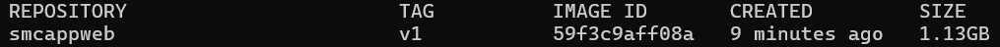
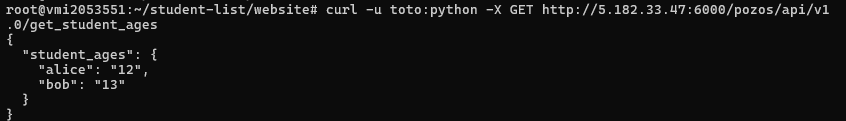
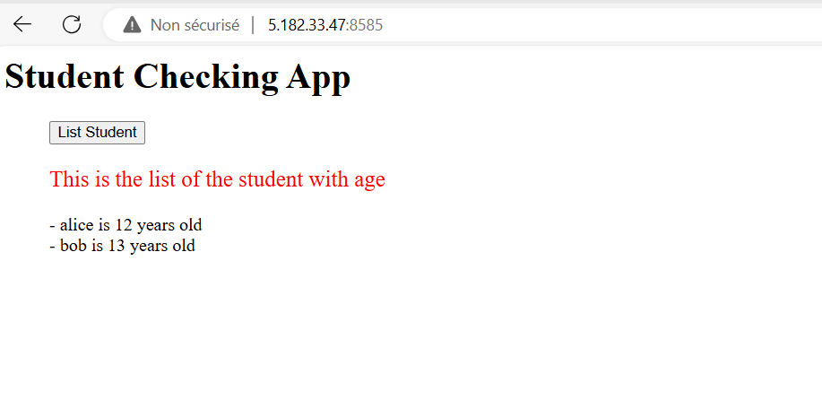
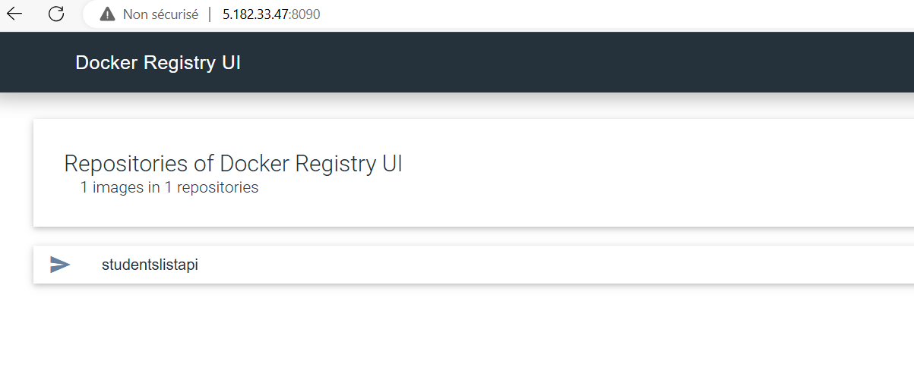

# Students APi List Details

deployment of backend and frontend of Studentslist

## Usage

This section explains how the application can be started and used.


## Requirements

The following are required in order to user Docker Compose:

- Docker
- Docker Compose
## Running the Application

From the applications's directory 


## Running Tests

To run tests, run the following command

build the image from Docker
```bash
  cd simple_api
  docker build --no-cache -t smcappweb:v1 .
``` 

ensure that the images and tag is like on the image: 



then  after that run

```bash
  cd ..
  docker-compose up -d
  docker compose logs
```

Either way , the following services will be started:

- the Rest API , accessible for test :
```bash
  curl -u toto:python -X GET http://localhost:6000/pozos/api/v1.0/get_student_ages
```  



- the front end :
 ```bash
  http://5.182.33.47:8585
```  


Docker Registry

From the applications's directory registry, to run private registry

 ```bash
  http://5.182.33.47:8585
``` 
```bash
  cd registry
  docker-compose up -d
  docker compose logs
```

example of push on private registry:

```bash
docker tag c2e8e10ce787 localhost:5500/studentslistapi:local

docker push localhost:5500/studentslistapi:local
```


